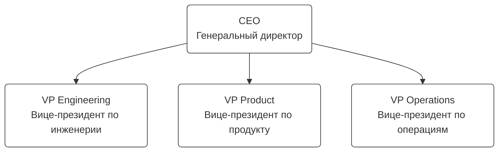

# Уровень 1: Верхняя структура организации

Верхний уровень организации, основные направления и их лидеры.

## Диаграмма

## Описание ролей

### CEO — Генеральный директор

- **Ответственность:** Стратегия, финансы, партнёрства

### VP Engineering — Вице-президент по инженерии

- **Ответственность:** Техническая стратегия, архитектура, витимы

### VP Product — Вице-президент по продукту

- **Ответственность:** Продуктовая стратегия, приоритизация, клиенты

### VP Operations — Вице-президент по операциям

- **Ответственность:** Финансы, HR, инфраструктура
