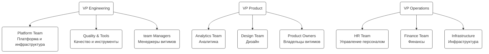

# Уровень 2: Основные блоки и команды

Второй уровень организации, основные команды и их структура под каждым вице-президентом.

## Диаграмма

## Описание команд

### Engineering блок

#### Platform Team — Платформа и инфраструктура

- **Ответственность:** Архитектура, библиотеки, DevOps
- **Численность:** TBD

#### Quality & Tools — Качество и инструменты

- **Ответственность:** Автоматизация, практики качества, AI-тулинг
- **Численность:** TBD

#### team Managers — Менеджеры витимов

- **Ответственность:** Управление витимами, delivery, развитие

### Product блок

#### Analytics Team — Аналитика

- **Ответственность:** Данные, метрики, insights
- **Численность:** TBD

#### Design Team — Дизайн

- **Ответственность:** UX/UI, дизайн-система, исследования
- **Численность:** TBD

#### Product Owners — Владельцы витимов

- **Ответственность:** Приоритизация, требования, стейкхолдеры

### Operations блок

#### HR Team — Управление персоналом

- **Ответственность:** Найм, развитие, компенсация
- **Численность:** TBD

#### Finance Team — Финансы

- **Ответственность:** Бюджетирование, планирование, отчётность
- **Численность:** TBD

#### Infrastructure — Инфраструктура

- **Ответственность:** IT-инфраструктура, безопасность, сети
- **Численность:** TBD
