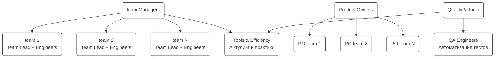

# Уровень 3: Витимы и специализированные команды

Третий уровень организации, продуктовые витимы и специализированные команды.

## Диаграмма

## Описание витимов и команд

### Продуктовые витимы

#### Типовая структура витима

**team N — [Название продукта]**

- **Ответственность:** Разработка, тестирование, production, поддержка
- **Типовой состав:**
  - Team Lead (инженер)
  - Инженеры (mix BE, FE, full-stack)
  - Product Owner
  - Поддержка от QA и Platform

### Специализированные команды

#### Tools & Efficiency — Инструменты и эффективность

- **Ответственность:** AI-тулинг, инструменты, практики, распространение
- **Численность:** TBD

#### QA Engineers — Инженеры качества

- **Ответственность:** Автоматизация, инфраструктура тестов, shift-left
- **Численность:** TBD

